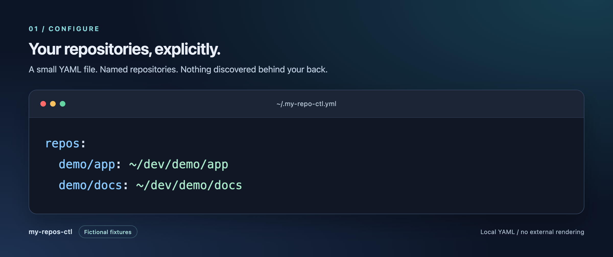
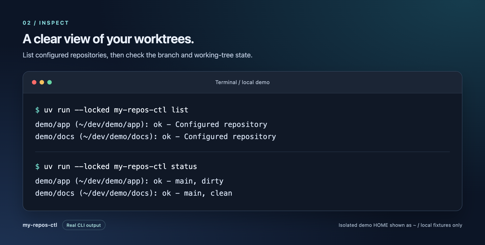
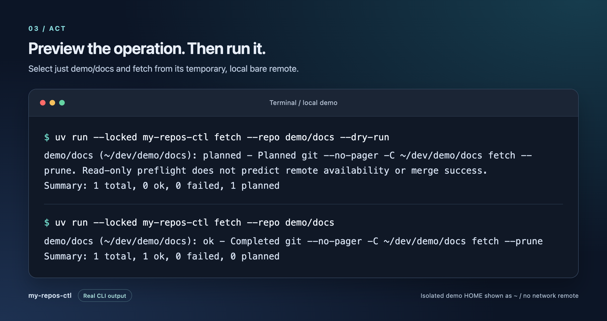
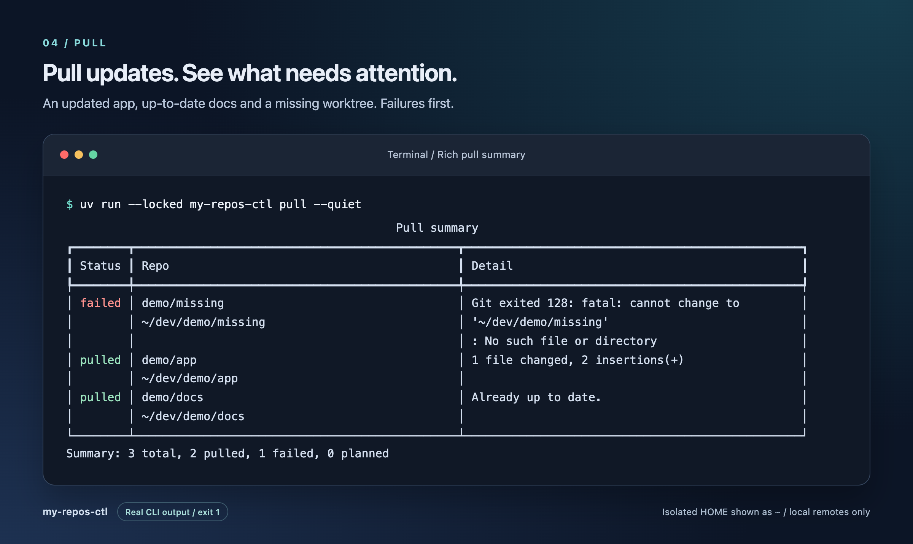

# my-repos-ctl

A small CLI for an explicitly configured set of local Git repositories. List
repositories, inspect their state and branches, pull, fetch, or switch branches
without changing global Git settings. Requires Python 3.12+ and Git; installation
and development use [uv](https://docs.astral.sh/uv/).

This is an installable `uv_build` package, intentionally not a PEP 723 script.
The runtime uses Python's standard library, PyYAML and Rich. It has no dependency on
Adobe tooling, Scout, or the source checkout after a normal installation.
There are no plugins, cloning commands, shell-command hooks, force operations,
resets, or automatic conflict recovery.

## Install, update and uninstall

Install from your local checkout:

```bash
uv tool install ~/dev/bossjones/my-repos-ctl
```

Or install from GitHub:

```bash
uv tool install git+https://github.com/bossjones/my-repos-ctl
```

uv creates a separate, persistent tool environment containing the runtime
package and its dependencies. Only the managed `my-repos-ctl` launcher is exposed
in the tool executable directory (normally `~/.local/bin` on Linux/macOS), not
the checkout, tests, or development tools. Run it from any directory. If uv
reports that its executable directory is missing from `PATH`, follow its
instructions or use `uv tool update-shell`.

A normal local install is a built snapshot: later checkout edits do not change
the installed command. Update the checkout yourself, then rebuild/reinstall it:

```bash
uv tool install --reinstall ~/dev/bossjones/my-repos-ctl
```

For an installation following the unpinned GitHub default branch:

```bash
uv tool upgrade my-repos-ctl
```

To explicitly reinstall from GitHub, or switch from the local source:

```bash
uv tool install --reinstall git+https://github.com/bossjones/my-repos-ctl
```

Upgrades retain the installed source and version constraints. A local-source
upgrade does not pull your checkout from GitHub; reinstall the updated local
checkout instead. A Git URL pinned to a tag or commit stays pinned until you
install a different source reference. Tool installs resolve runtime dependencies
separately from the project's development lockfile. Do not use `--force` to
overwrite an unrelated executable.

For development, optionally expose an editable tool installation:

```bash
uv tool install --editable ~/dev/bossjones/my-repos-ctl
```

That command follows source edits and requires the checkout to remain in place.
Reinstall after changing dependencies or entry points. This tool environment is
separate from the project's `.venv`; use `uv sync` and `uv run` for project checks.

Remove the installed tool and its environment:

```bash
uv tool uninstall my-repos-ctl
```

Uninstalling does not remove your checkout, repositories, or configuration.

## Configuration

The default file is **`~/.my-repo-ctl.yml`** (singular `repo`). Create it yourself;
installation never creates or overwrites personal configuration. Use
[`config.example.yml`](config.example.yml) as a fictional example:

```yaml
repos:
  demo/app: ~/dev/demo/app
  demo/docs: ~/dev/demo/docs
```

For a new personal config, copy the example, then edit the names and paths to
match your own worktrees. `cp -n` leaves an existing destination untouched:

```bash
cp -n config.example.yml ~/.my-repo-ctl.yml
chmod 600 ~/.my-repo-ctl.yml
```

If you already maintain an ignored `config.local.yml` in this checkout, use
`cp -n config.local.yml ~/.my-repo-ctl.yml` instead, or select it directly with
`my-repos-ctl --config ./config.local.yml list`. Keep checkout-local inventories
in ignored files such as `config.local.yml`; never put them in the public example
or commit them. Restrict private config files to mode `600`.

Organization-qualified names such as `demo/app` are literal configuration keys,
not a discovery mechanism. They prevent basename collisions when different
organizations have repositories with the same short name. Select the exact key
with `--repo demo/app`.

`repos` must be a nonempty mapping of nonempty names to nonempty string paths.
Duplicate YAML keys, duplicate resolved paths, invalid types and unknown
top-level fields are errors. `~` expands to your home directory. Relative
repository paths resolve relative to the config file, not your working directory.
Paths must identify actual non-bare Git worktree roots; linked worktrees are
supported, but nested directories inside another repository are not roots.
For a service nested inside a larger repository, configure the parent worktree
root rather than the service subdirectory.

Keep your personal configuration and credentials out of version control.

## A local demo

These locally rendered cards use fictional `demo/app` and `demo/docs` repositories.
Terminal output comes from real CLI runs against temporary Git worktrees and
local bare remotes, with isolated HOME, XDG and Git configuration. Only the exact
temporary HOME prefix is shortened to `~`; no real inventory or private paths
are shown, and nothing was uploaded to an external rendering service.

**Configure** the repositories you want to manage:



**Inspect** both worktrees: demo/app is on main with a local edit; demo/docs is clean:



**Preview, then fetch** just demo/docs from its local bare remote:



**Pull with a Rich summary**: an updated app, an up-to-date docs repo and a missing
worktree. Failures appear first; successful repositories are still processed:



See [screenshot provenance and reproduction](docs/images/README.md) for exact
commands, fixture setup and the self-contained HTML/CSS renderer.

## Commands and options

| Command | Operation |
| --- | --- |
| `list` | Show configured names and resolved paths; no Git or network calls. |
| `status` | Show branch or detached commit, dirty state and local path. |
| `branches` | List local and remote-tracking branches without fetching. |
| `pull` | Run `git pull --rebase --autostash`. |
| `fetch` | Run `git fetch --prune` with Git's configured default remote. |
| `checkout BRANCH` | Switch to a local branch or track an unambiguous existing remote branch. |

Common options work **before or after the subcommand**:

| Option | Meaning |
| --- | --- |
| `--config PATH` | Override `~/.my-repo-ctl.yml`. |
| `--repo NAME` | Select an exact configured name; repeat to select several. |
| `--json` | Emit one JSON object rather than human-readable output. |
| `--timeout SECONDS` | Positive timeout per Git subprocess; default `300`. |

Without selectors, process every configured repository in YAML order. Unknown
names fail before any operation; duplicate selectors do not process a repo twice.

```bash
my-repos-ctl list
my-repos-ctl --repo demo/app --repo demo/docs status
my-repos-ctl branches --config ./config.example.yml --json
my-repos-ctl --timeout 300 fetch --repo demo/app --dry-run
my-repos-ctl checkout feature/example --repo demo/app --dry-run
```

`pull`, `fetch` and `checkout` accept `--dry-run`. They perform read-only
preflight and report planned Git commands without running mutations. Results
are **planned**, not completed; dry-run does not predict remote availability,
merge success, or changes that happen after preflight.

Human output identifies each repository; mutations include a summary. JSON
output is one object with `command`, `results` and `summary`. Each result includes
`name`, `path`, `status` and `message`, plus command-specific data. Statuses
distinguish success, failure and planned work. JSON stdout stays parseable;
configuration/argument errors go to stderr.

### Rich pull output

The default pull prints each repository's full result as it finishes, before
starting the next repository, then a Rich **Pull summary** table. For the
table-and-counts-only experience:

```bash
my-repos-ctl pull --quiet
# Equivalent short option:
my-repos-ctl pull -q
# From the development checkout:
uv run --locked my-repos-ctl pull --quiet
```

Preview without mutating repositories, or retain machine-readable output:

```bash
my-repos-ctl pull --dry-run --quiet
my-repos-ctl pull --repo demo/app --repo demo/docs
my-repos-ctl pull --json --quiet
```

The table has **Status / Repo / Detail** columns, includes each configured name
and full path, and puts failures first while preserving selection order within
each status group. Actual operations still follow selection order. Cells wrap
to the terminal width; redirected output does not force ANSI color. Human
statuses are `pulled`, `failed` and `planned`, followed by a counts line:
`Summary: N total, X pulled, Y failed, Z planned`.

Details prefer the first `error:`/`fatal:` line, otherwise the last nonempty
line, capped at 160 characters. Default live output and JSON retain the full
diagnostic. Successful pull messages now contain Git stdout when available,
or an explicit completed-command message when Git is silent.

`--quiet`/`-q` is pull-only and goes after the subcommand. With `--json`, JSON
wins: no progress or table, unchanged result order and summary keys
(`total`, `ok`, `failed`, `planned`). Other commands keep their existing output.

| Exit | Meaning |
| --- | --- |
| `0` | Every selected repository succeeded, including successful dry-run preflight. |
| `1` | A repository or Git operation failed; other selected repos were still processed. |
| `2` | Invalid configuration, selector or arguments; no operations were started. |

Interrupting the command stops further work. Repository failures, missing Git,
timeouts and Git diagnostics are surfaced rather than silently skipped.

## Safety and conflict recovery

Checkout refuses dirty worktrees, including untracked files. It never forces a
switch, discards changes, silently stashes, or automatically fetches. Commit or
otherwise preserve changes yourself before retrying.

Checkout takes a literal branch name, not a revision expression or previous-branch
shorthand such as `@{-1}`. A local branch takes precedence; otherwise exactly one
existing remote-tracking candidate must match. Ambiguous candidates fail even if
Git has a preferred checkout remote. Custom fetch refspecs that rename branches
or store tracking refs outside the conventional layout are not inferred; create
an explicit local tracking branch with Git first.

Pull deliberately allows dirty worktrees through `--rebase --autostash`. **Git
can exit zero even when applying its autostash causes conflicts.** The CLI checks
for unmerged entries after a successful pull and reports them as failure.
Autostash is not a guarantee that local changes or untracked files cannot obstruct
the operation.

On failure, inspect the reported repository with `git status` and read Git's
diagnostics. Resolve conflicts manually and follow the appropriate Git
rebase instructions if a rebase is still active. Inspect `git stash list` when
Git reports that it preserved an autostash; confirm where your local changes
are before applying or deleting any stash. A stash-application conflict after a
completed rebase is not necessarily an active rebase. Do not blindly reset,
force checkout, or rerun pull as a recovery strategy.

Git runs without a shell, with noninteractive stdin and disabled pagers.
Timeouts bound each subprocess, not the duration of the entire multi-repo run.

## Development

From the checkout, use the committed lockfile:

```bash
uv sync --locked
uv run --locked ruff format --check .
uv run --locked ruff check .
uv run --locked ty check
uv run --locked pytest
uv build
```

`uv run --locked my-repos-ctl --help` runs the development command. pytest discovers
`tests/`, reports missing runtime-package coverage and requires at least **85%**.
The `mutation` marker identifies tests that mutate isolated temporary Git repos;
the default gate includes them. Ruff targets Python 3.12 with an 88-character
line length and `E`, `F`, `I`, `UP`, `B` rules. ty is the sole type checker and
checks runtime `src/`, not the test suite.

CI runs the same checks and builds on Python 3.12 Linux/macOS, plus Python 3.13
Linux to check next-version compatibility.

Use TDD and only temporary repositories, local bare remotes and isolated
HOME/config/XDG/Git settings in tests. Never run tests against real managed repos,
personal YAML or network remotes. Before release, inspect the wheel for runtime
package/metadata only, then smoke-test its installed launcher outside the checkout
using temporary config and repos.

See [AGENTS.md](AGENTS.md) for contributor guidance and
[docs/design.md](docs/design.md) for the design contract.
